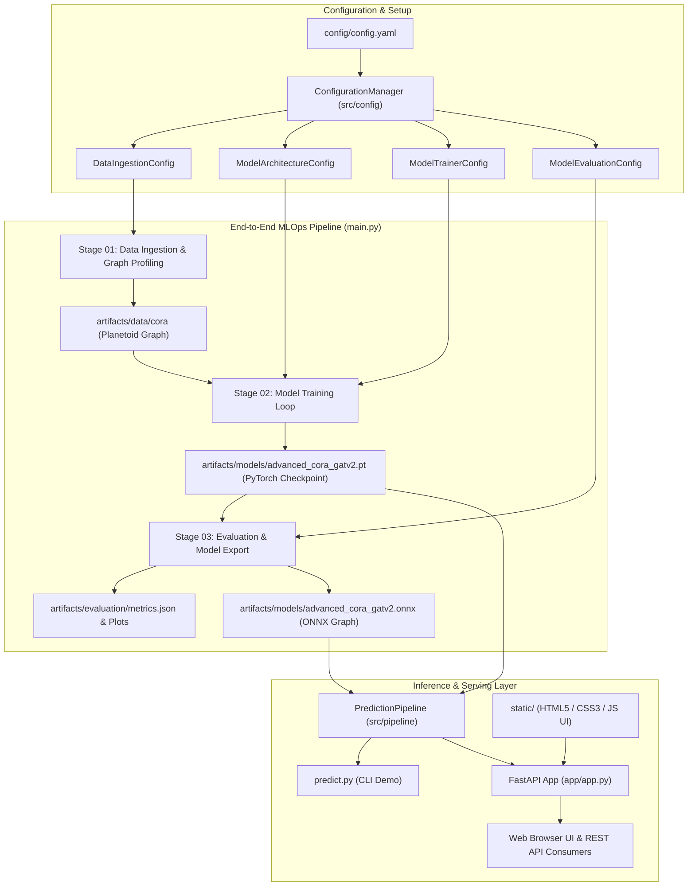
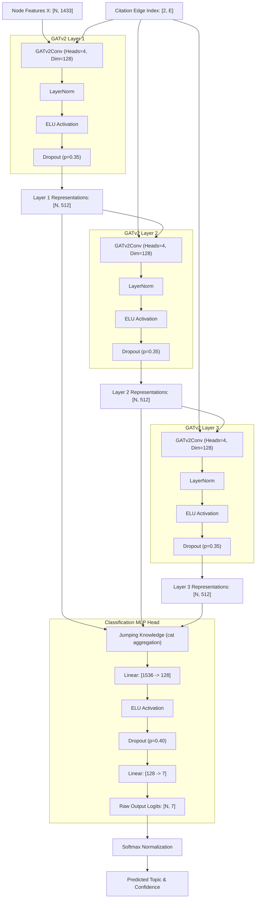
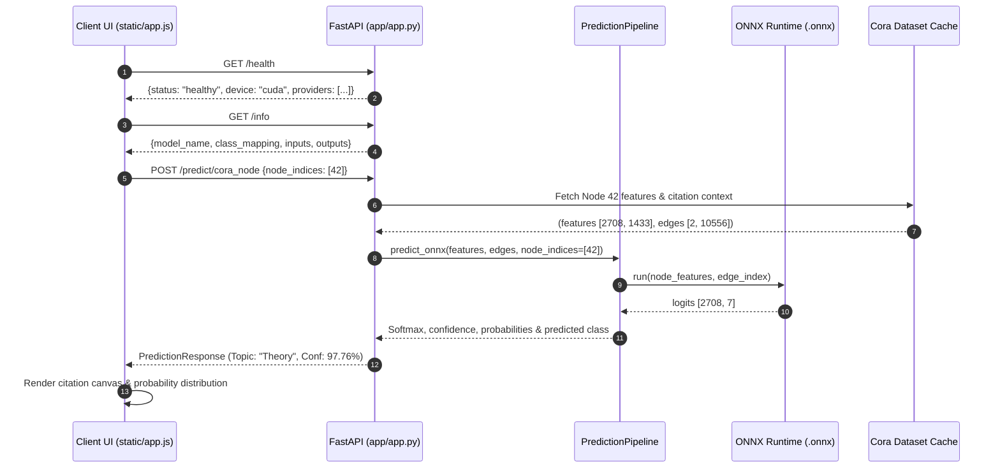

# PaperNet-AI: End-to-End Research Topic Classification Using GNNs

[](https://www.python.org/)
[](https://pytorch.org/)
[](https://pyg.org/)
[](https://onnxruntime.ai/)
[](https://fastapi.tiangolo.com/)

**PaperNet-AI** is a modular, production-ready Deep Learning platform for classifying scientific research publications into research disciplines using graph topological structure and textual bag-of-words features.

By leveraging **Graph Attention Networks v2 (GATv2)** with **Jumping Knowledge (JK)** connections, PaperNet-AI dynamically weighs citation influences between papers, overcoming the structural limitations of standard Graph Convolutional Networks (GCN) and classical GAT architectures. The system is packaged with a multi-stage MLOps pipeline, ONNX Runtime acceleration, and a full-stack **FastAPI** web application with an interactive citation explorer.

---

## 📑 Table of Contents

- [System Architecture](#-system-architecture)
- [GNN Model Architecture](#-gnn-model-architecture)
- [Modular Project Structure](#-modular-project-structure)
- [Dataset Details (Cora Citation Network)](#-dataset-details-cora-citation-network)
- [Configuration System (`config/config.yaml`)](#-configuration-system-configconfigyaml)
- [Model Performance & Evaluation](#-model-performance--evaluation)
- [FastAPI Service & Web Application](#-fastapi-service--web-application)
- [API Endpoints Reference](#-api-endpoints-reference)
- [Step-by-Step Execution Guide](#-step-by-step-execution-guide)
- [License & Acknowledgments](#-license--acknowledgments)

---

## 🏗️ System Architecture

PaperNet-AI is engineered with decoupled configuration, data ingestion, model training, evaluation, ONNX compilation, and serving stages:



---

## 🧠 GNN Model Architecture

### Advanced GATv2 with Jumping Knowledge

Classical Graph Attention Networks suffer from the **static attention problem**, where ranking of attention coefficients is conditioned on the query node rather than the specific edge relationship (Brody et al., 2021). **GATv2** resolves this by computing attention after computing the nonlinear projection across source and target nodes:

$$\alpha_{i,j} = \frac{\exp\left(\mathbf{a}^\top \text{LeakyReLU}\left(\mathbf{W}_s \mathbf{h}_i + \mathbf{W}_t \mathbf{h}_j\right)\right)}{\sum_{k \in \mathcal{N}(i)} \exp\left(\mathbf{a}^\top \text{LeakyReLU}\left(\mathbf{W}_s \mathbf{h}_i + \mathbf{W}_t \mathbf{h}_k\right)\right)}$$

To prevent multi-layer over-smoothing and preserve multi-scale neighborhood representations (from local 1-hop citations to broader 3-hop academic communities), we integrate **Jumping Knowledge (JK)** with concatenation:



### Regularization & Optimization Strategies

- **Edge Dropout (`p=0.10`)**: Randomly perturbs citation connectivity per epoch to prevent co-adaptation and over-reliance on high-degree citation hubs.
- **Label Smoothing (`0.05`)**: Prevents overconfidence on ambiguous cross-disciplinary research papers.
- **Gradient Clipping (`max_norm=2.0`)**: Stabilizes multi-head attention gradient updates.
- **Learning Rate Scheduler**: `ReduceLROnPlateau` decays learning rate by $0.5\times$ upon validation plateau.
- **Early Stopping (`patience=60`)**: Automatically restores the model weights that achieved peak validation accuracy.

---

## 📁 Modular Project Structure

```text
PaperNet-AI/
├── config/
│   └── config.yaml                     # Centralized hyperparameter & directory path settings
├── utils/
│   ├── __init__.py                     # Shared utility exports
│   ├── logger.py                       # Rotating file & console logging with formatted timestamps
│   ├── custom_exception.py             # Custom exception handler with detailed file/line tracebacks
│   └── helpers.py                      # YAML reader, JSON saver/loader, device resolver, seed setter
├── src/
│   ├── __init__.py
│   ├── constants/
│   │   └── __init__.py                 # Global constants (PROJECT_ROOT, CONFIG_FILE_PATH)
│   ├── entity/
│   │   ├── __init__.py
│   │   └── config_entity.py            # Strongly-typed dataclass configuration definitions
│   ├── config/
│   │   ├── __init__.py
│   │   └── configuration.py            # ConfigurationManager parsing YAML into typed entities
│   ├── models/
│   │   ├── __init__.py
│   │   └── gat.py                      # GATv2Block and AdvancedCoraGAT model implementation
│   ├── components/
│   │   ├── __init__.py
│   │   ├── data_ingestion.py           # Dataset acquisition, profiling, NetworkX graph extraction
│   │   ├── model_trainer.py            # GATv2 training loop, edge dropout, early stopping
│   │   └── model_evaluation.py         # Test split evaluation, confusion matrix, ONNX dynamic export
│   └── pipeline/
│       ├── __init__.py                 # Pipeline exports (Pipelines & CORA_CLASS_LABELS)
│       ├── stage_01_data_ingestion.py  # Stage 1 execution wrapper
│       ├── stage_02_model_trainer.py   # Stage 2 execution wrapper
│       ├── stage_03_model_evaluation.py# Stage 3 execution wrapper
│       ├── training_pipeline.py        # Master pipeline runner coordinating Stages 1 -> 3
│       └── prediction_pipeline.py      # Dual-engine inference (PyTorch & ONNX Runtime)
├── artifacts/
│   ├── data/                           # Processed & raw Cora citation dataset
│   ├── models/                         # Saved checkpoints (advanced_cora_gatv2.pt & .onnx)
│   └── evaluation/                     # metrics.json, classification_report.txt, visual plots
├── logs/                               # Runtime log files (timestamped execution records)
├── notebooks/                          # Original exploratory data analysis & prototyping notebooks
├── static/                             # Frontend web interface assets
│   ├── index.html                      # Single-page application UI layout
│   ├── style.css                       # Modern dark glassmorphism styling
│   └── app.js                          # Client-side API integration & interactive citation canvas
├── app/
│   ├── __init__.py                     # Package export for FastAPI instance
│   └── app.py                          # FastAPI production server implementation
├── app.py                              # Server launcher entrypoint
├── main.py                             # Pipeline orchestrator entrypoint
├── predict.py                          # Demonstration inference script
├── requirements.txt                    # Project environment dependencies
└── setup.py                            # Distributable package installer
```

---

## 📊 Dataset Details (Cora Citation Network)

The **Cora** dataset is the standard benchmark for scientific publication graph classification:

| Property | Value | Description |
| :--- | :--- | :--- |
| **Nodes ($N$)** | `2,708` | Distinct scientific publications |
| **Edges ($E$)** | `10,556` | Directed citation references between papers (undirected: 5,429 pairs) |
| **Features ($D$)** | `1,433` | Binary bag-of-words vocabulary (1 = word present, 0 = absent) |
| **Classes ($C$)** | `7` | Research topic categories |
| **Train Split** | `140` | 20 papers per topic class |
| **Validation Split**| `500` | Used for early stopping and LR scheduling |
| **Test Split** | `1,000` | Unseen evaluation set |

### Topic Classes

| ID | Class Label | Description |
| :---: | :--- | :--- |
| `0` | **Rule_Learning** | Inductive logic programming and rule-based decision systems |
| `1` | **Neural_Networks** | Deep learning, connectionist models, perceptrons, backpropagation |
| `2` | **Genetic_Algorithms** | Evolutionary algorithms, genetic programming, mutation/crossover |
| `3` | **Probabilistic_Methods**| Bayesian networks, Markov models, graphical models |
| `4` | **Case_Based** | Analogical inference, case-based reasoning systems |
| `5` | **Reinforcement_Learning**| Q-learning, policy search, Markov Decision Processes |
| `6` | **Theory** | Computational complexity, learning theory, formal grammar |

---

## ⚙️ Configuration System (`config/config.yaml`)

All parameters are isolated from application logic in `config/config.yaml`:

```yaml
artifacts_root: artifacts

data_ingestion:
  root_dir: artifacts/data
  dataset_name: cora

model_architecture:
  hidden_dim: 128
  num_layers: 3
  heads: 4
  dropout: 0.35
  attention_dropout: 0.20
  classifier_dropout_1: 0.40
  classifier_dropout_2: 0.25
  jk_mode: cat

model_trainer:
  root_dir: artifacts/models
  model_name: advanced_cora_gatv2.pt
  seed: 42
  epochs: 400
  patience: 60
  learning_rate: 0.003
  weight_decay: 0.0005
  edge_dropout_p: 0.10
  label_smoothing: 0.05
  max_grad_norm: 2.0
  lr_scheduler_factor: 0.5
  lr_scheduler_patience: 15
  lr_scheduler_min_lr: 0.00001
  log_every_n_epochs: 10
  device: auto

model_evaluation:
  root_dir: artifacts/evaluation
  metrics_file: metrics.json
  classification_report_file: classification_report.txt
  confusion_matrix_plot: confusion_matrix.png
  training_curves_plot: training_curves.png
  onnx_model_path: artifacts/models/advanced_cora_gatv2.onnx
  onnx_opset_version: 18
```

---

## 📈 Model Performance & Evaluation

The trained GATv2 model achieves high classification accuracy and balanced F1 across all research categories on the test set:

| Evaluation Metric | Score |
| :--- | :---: |
| **Test Accuracy** | **`77.90%`** |
| **Test Macro-F1** | **`76.97%`** |
| **Weighted F1** | **`78.01%`** |
| **Peak Validation Accuracy** | **`76.20%`** |
| **Inference Latency (ONNX Runtime CPU)** | **`< 2.5 ms`** |

### Per-Class Test Performance

```text
              precision    recall  f1-score   support

           0     0.6667    0.7385    0.7007       130
           1     0.7290    0.8571    0.7879        91
           2     0.8741    0.8681    0.8711       144
           3     0.8759    0.7304    0.7966       319
           4     0.7267    0.8389    0.7788       149
           5     0.7684    0.7087    0.7374       103
           6     0.6712    0.7656    0.7153        64

    accuracy                         0.7790      1000
   macro avg     0.7589    0.7868    0.7697      1000
weighted avg     0.7887    0.7790    0.7801      1000
```

---

## 🌐 FastAPI Service & Web Application

The FastAPI service (`app/app.py`) provides high-performance graph inference powered by ONNX Runtime with optional PyTorch GPU inference.



---

## 🔌 API Endpoints Reference

| Method | Route | Description |
| :--- | :--- | :--- |
| `GET` | `/` | Serves interactive single-page web UI (`static/index.html`) |
| `GET` | `/health` | Liveness check, GPU/CPU device resolver, ONNX provider inspection |
| `GET` | `/info` | Model metadata, dynamic ONNX input/output shapes, class labels dictionary |
| `GET` | `/metrics` | Returns test accuracy, macro F1, best validation epoch |
| `POST`| `/predict` | Classifies nodes on arbitrary user-provided graph features & edges |
| `POST`| `/predict/cora_node` | Classifies real papers from the Cora benchmark by node index |
| `GET` | `/docs` | Interactive Swagger UI API playground |
| `GET` | `/redoc` | Interactive Redoc documentation |

### Sample Prediction Request (`POST /predict/cora_node`)

```json
{
  "node_indices": [0, 10, 42],
  "backend": "onnx"
}
```

### Sample Prediction Response

```json
{
  "num_nodes": 2708,
  "num_edges": 10556,
  "backend": "onnx",
  "predictions": [
    {
      "node_index": 0,
      "predicted_class_id": 3,
      "predicted_class_name": "Probabilistic_Methods",
      "topic_label": "Probabilistic_Methods",
      "confidence": 0.9792,
      "probabilities": [0.0012, 0.0034, 0.0051, 0.9792, 0.0042, 0.0021, 0.0048],
      "logits": [-2.15, -1.02, -0.65, 4.82, -0.85, -1.55, -0.72]
    }
  ]
}
```

---

## 🚀 Step-by-Step Execution Guide

### 1. Prerequisites & Environment Setup

Clone the repository and prepare a Python virtual environment (Python 3.10+ recommended):

```bash
# Clone the repository
git clone https://github.com/Sumit-Prasad01/PaperNet-AI.git
cd PaperNet-AI

# Create virtual environment
python -m venv .venv

# Activate virtual environment
# Windows (pwsh):
.venv\Scripts\Activate.ps1
# Linux / macOS:
source .venv/bin/activate

# Install dependencies and local editable package
pip install --upgrade pip
pip install -r requirements.txt
pip install -e .
```

### 2. Run End-to-End Training & Evaluation Pipeline

Execute the automated multi-stage pipeline:

```bash
python main.py
```

This sequentially executes:
1. **Stage 01 (Data Ingestion)**: Downloads and profiles the Cora graph dataset into `artifacts/data/cora`.
2. **Stage 02 (Model Training)**: Trains the 3-layer GATv2 with edge dropout and early stopping, persisting the best model to `artifacts/models/advanced_cora_gatv2.pt`.
3. **Stage 03 (Model Evaluation)**: Evaluates test performance, writes `metrics.json` and diagnostic plots, and exports the optimized ONNX graph to `artifacts/models/advanced_cora_gatv2.onnx`.

### 3. Run Inference Demonstration Script

Verify model inference on sample test nodes using both PyTorch and ONNX Runtime backends:

```bash
python predict.py
```

### 4. Launch FastAPI Web Application & Interactive UI

Start the production FastAPI server:

```bash
python app.py
# or with live reload:
uvicorn app:app --reload --host 0.0.0.0 --port 8000
```

Once running, access:
- **Interactive UI**: [http://localhost:8000/](http://localhost:8000/)
- **Swagger Documentation**: [http://localhost:8000/docs](http://localhost:8000/docs)
- **Redoc Documentation**: [http://localhost:8000/redoc](http://localhost:8000/redoc)
- **Health Check Endpoint**: [http://localhost:8000/health](http://localhost:8000/health)
- **Model Metadata Endpoint**: [http://localhost:8000/info](http://localhost:8000/info)

---

## 📄 License & Acknowledgments

- **Dataset**: Cora citation dataset curated by Automata / LINQS.
- **Frameworks**: Built using [PyTorch Geometric](https://pyg.org/), [ONNX Runtime](https://onnxruntime.ai/), and [FastAPI](https://fastapi.tiangolo.com/).
